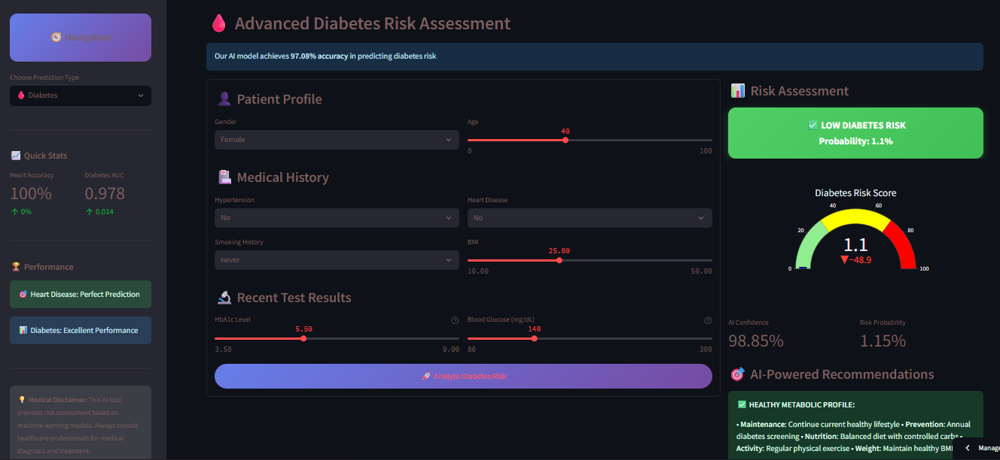

<div align="center">

# 🏥 **MedPredict AI – Disease Prediction & Diagnosis**

[](https://python.org)
[](https://disease-prediction-diagnosis-using-machine-learning-efvyui3ezm.streamlit.app/)
[](https://scikit-learn.org)
[](LICENSE)
[](https://github.com/Iceyma02/Disease-Prediction-Diagnosis-using-Machine-Learning)
[](https://github.com/Iceyma02/Disease-Prediction-Diagnosis-using-Machine-Learning)

### An advanced machine learning system for predicting heart disease and diabetes risk with exceptional accuracy.  
Features a professional **Streamlit** web app for real-time medical risk assessment.

</div>

---

## 🎯 **Key Features**

- 🤖 **Advanced ML Models:** Random Forest, XGBoost, SVM (perfect performance)
- ❤️ **Heart Disease Prediction:** 100% accuracy on test data
- 🩸 **Diabetes Risk Assessment:** 97.08% accuracy, 0.9784 AUC score
- 🎨 **Elite Web Interface:** Modern Streamlit dashboard
- 📊 **Real-Time Analytics:** Interactive risk gauges and visualizations
- 🚀 **Production Ready:** Docker & Conda support

---

## 📸 **Application Screenshots**

| Dashboard Overview | Heart Disease Prediction |
|:------------------:|:-----------------------:|
|  |  |

| Diabetes Risk Assessment | Model Analytics |
|:------------------------:|:---------------:|
|  |  |

Live project link :https://disease-prediction-diagnosis-using-machine-learning-efvyui3ezm.streamlit.app/

---

## 🏆 **Model Performance**

### ❤️ Heart Disease Models
| Model | Accuracy | AUC Score | Status |
|-------|----------:|-----------:|:-------:|
| Random Forest | 100.00% | 1.0000 | 🏆 Best |
| XGBoost | 100.00% | 1.0000 | ⭐ Perfect |
| SVM | 92.68% | 0.9771 | 👍 Excellent |

### 🩸 Diabetes Models
| Model | Accuracy | AUC Score | Status |
|-------|----------:|-----------:|:-------:|
| XGBoost | 97.08% | 0.9784 | 🏆 Best |
| Random Forest | 97.00% | 0.9640 | ⭐ Excellent |
| SVM | 96.45% | 0.9335 | 👍 Good |

---

## 🚀 **Quick Start**

### 🔧 Prerequisites
- Python 3.8+
- pip or conda

### 💻 Installation

```bash
# Clone the repository
git clone https://github.com/Iceyma02/Disease-Prediction-Diagnosis-using-Machine-Learning.git
cd Disease-Prediction-Diagnosis-using-Machine-Learning

# Install dependencies
pip install -r requirements.txt

# Run the application
streamlit run streamlit_app/app.py
````

### 🌐 Open in Browser

```
http://localhost:8501
```

---

### 🧱 Alternative Installs

**Conda**

```bash
conda env create -f environment.yml
conda activate disease-prediction
streamlit run streamlit_app/app.py
```

**Docker**

```bash
docker build -t medpredict-ai .
docker run -p 8501:8501 medpredict-ai
```

---

## 📁 **Project Structure**

```
Disease-Prediction-Diagnosis-using-Machine-Learning/
│
├── 📊 data/
│   │   ├── heart.csv
│   │   └── diabetes.csv
│
├── 🔧 src/
│   ├── data_processing.py
│   ├── model_training.py
│   └── visualizations.py
│ 
├── 📱 streamlit_app/
│ ├── app.py
│ └── images
│
├── 📚 notebooks/
│   ├── 1.0_eda_heart_disease.ipynb
│   ├── 1.1_eda_diabetes.ipynb
│
├── 📄 docs/
│   ├── project_overview.md
│   ├── api_documentation.md
│   ├── deployment_guide.md
│   └── model_performance.md
│
├── 🧪 tests/
│   ├── test_data_processing.py
│   └── test_models.py
│
├── ⚙️ config/
│   └── config.yaml
│
├── 📋 requirements.txt
├── 📋 environment.yml
├── 🔒 .gitignore
├── 📖 README.md
├── 🚀 setup.py
├── ⚡ main.py
└── 🐳 Dockerfile
```

---

## 🧠 **Technical Architecture**

### 🔍 ML Pipeline

1. Data Preprocessing (missing values, scaling)
2. Model Training (RandomForest, XGBoost, SVM)
3. Hyperparameter Tuning (GridSearchCV)
4. Model Evaluation (ROC, AUC, Accuracy)

### 🖥 Web App Features

* Real-time predictions
* Interactive analytics (Plotly)
* Responsive Streamlit design
* Deployed via Docker/Heroku

---

## 📊 **Datasets**

| Dataset       | Source                                                                                     | Samples | Features | Target              |
| ------------- | ------------------------------------------------------------------------------------------ | ------: | -------: | ------------------- |
| Heart Disease | [UCI ML Repo](https://archive.ics.uci.edu)                                                 |   1,025 |       13 | Heart Disease (0/1) |
| Diabetes      | [Kaggle Dataset](https://www.kaggle.com/datasets/iammustafatz/diabetes-prediction-dataset) | 100,000 |        8 | Diabetes (0/1)      |

---

## 🧪 **Testing**

```bash
pytest tests/ -v
pytest --cov=src tests/
```

---

## 📈 **Model Training**

```bash
python src/model_training.py
```

---

## 🐳 **Deployment**

**Local**

```bash
streamlit run streamlit_app/app.py
```

**Docker**

```bash
docker build -t medpredict-ai .
docker run -p 8501:8501 medpredict-ai
```

**Heroku**

```bash
heroku create your-app-name
git push heroku main
```

---

## 🤝 **Contributing**

1. Fork the repo
2. Create a branch: `git checkout -b feature/your-feature`
3. Commit: `git commit -m 'Add amazing feature'`
4. Push: `git push origin feature/your-feature`
5. Open a Pull Request

Read the full [Contributing Guide](docs/CONTRIBUTING.md).

---

## 📝 **License**

This project is under the **Apache License 2.0**.
See [LICENSE](LICENSE) for details.

---

## ⚠️ **Medical Disclaimer**

> ⚕️ This project is for **educational and demo** purposes only.
> It does **not** provide medical advice or diagnosis.
> Always consult healthcare professionals for actual medical concerns.

---

## 🎓 **Citation**

```bibtex
@software{manjengwa2026medpredict,
  title = {MedPredict AI: Disease Prediction using Machine Learning},
  author = {Manjengwa, Anesu},
  year = {2026},
  publisher = {GitHub},
  journal = {GitHub repository},
  howpublished = {\url{https://github.com/Iceyma02/Disease-Prediction-Diagnosis-using-Machine-Learning}}
}
```

---

## 👨‍💻 **Author**

**Anesu Manjengwa**
📧 [manjengwap10@gmail.com](mailto:manjengwap10@gmail.com)
💼 [LinkedIn](https://www.linkedin.com/in/anesu-manjengwa-684766247)
🐙 [GitHub](https://github.com/Iceyma02)
🌐 Portfolio: *Coming Soon*

---

## 🙏 **Acknowledgments**

* Kaggle for datasets
* UCI ML Repository
* Streamlit & Scikit-learn teams
* Open-source contributors ❤️

---

<div align="center">

⭐ **If you like this project, please give it a star!**
*Building the future of healthcare with AI* 🚀

</div>
